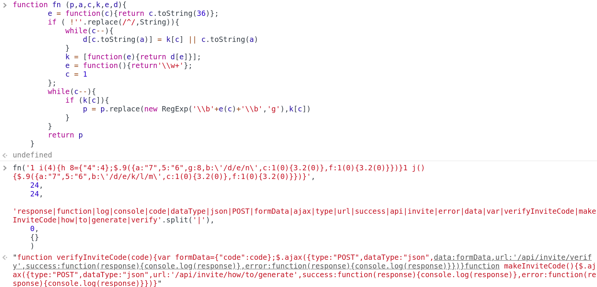

# Registration

In order to join to the platform, you should solve the first challenge.

Once in the **JOIN** section, open we are asked to prompt a code. We don't have any code yet, so the first step is to look into the page source to find something. After a digging some time, you will find a link to a JS script: **/js/inviteapi.min.js**. After openning and formating it:

```javascript

eval(
    function  (p,a,c,k,e,d){
        e = function(c){return c.toString(36)};
        if ( !''.replace(/^/,String)){
            while(c--){
                d[c.toString(a)] = k[c] || c.toString(a)
            }
            k = [function(e){return d[e]}];
            e = function(){return'\\w+'};
            c = 1
        };
        while(c--){
            if (k[c]){
                p = p.replace(new RegExp('\\b'+e(c)+'\\b','g'),k[c])
            }
        }
        return p    
    }
    ('1 i(4){h 8={"4":4};$.9({a:"7",5:"6",g:8,b:\'/d/e/n\',c:1(0){3.2(0)},f:1(0){3.2(0)}})}1 j(){$.9({a:"7",5:"6",b:\'/d/e/k/l/m\',c:1(0){3.2(0)},f:1(0){3.2(0)}})}',
    24,
    24,
    'response|function|log|console|code|dataType|json|POST|formData|ajax|type|url|success|api|invite|error|data|var|verifyInviteCode|makeInviteCode|how|to|generate|verify'.split('|'),
    0,
    {}
    )
)

```

So basically, it's a JS functiont that it's being called with some specific parameters.

It's not necessary to fully understand the whole thing, we can just use the Chrome/Firefox JS console and make use of this code. Nevertheless, if you copy & paste it, it won't work due to a name for the function is missing. What I did was just to choose some name, copy only the part of the function definition an afterwards call it with the specific parameters:



The answer gathered is again JS code:

```javascript

function verifyInviteCode(code){
    var formData = {"code":code};
    $.ajax({
        type:"POST",
        dataType:"json",
        data:formData,url:'/api/invite/verify',
        success:function(response){
            console.log(response)
        },
        error:function(response){
            console.log(response)
        }
    })
}

function makeInviteCode(){
    $.ajax({
        type:"POST",
        dataType:"json",
        url:'/api/invite/how/to/generate',
        success:function(response){
            console.log(response)
        },
        error:function(response){
            console.log(response)
        }
    })
}

```

This time seems to show us how the **InviteCode** related functions are invoked... Time to use **burp**:

Issuing the following POST we will receive an answer with some information encoded: 

```

POST /api/invite/how/to/generate HTTP/1.1
Host: www.hackthebox.eu
Connection: close
Accept: */*

```

```

{"success":1,"data":{"data":"SW4gb3JkZXIgdG8gZ2VuZXJhdGUgdGhlIGludml0ZSBjb2RlLCBtYWtlIGEgUE9TVCByZXF1ZXN0IHRvIC9hcGkvaW52aXRlL2dlbmVyYXRl","enctype":"BASE64"},"0":200}

```

After decoding the value inside **data** which is encoded with the encoding mentioned in **enctype**, you'll get the a message saying:
**In order to generate the invite code, make a POST request to /api/invite/generate**

So, let folow their order:

```

POST /api/invite/generate HTTP/1.1
Host: www.hackthebox.eu
Connection: close
Accept: */*

```

```

{"success":1,"data":{"code":"WElLQVktWFlFWk8tTkpaTEotVVNFQVMtWkJBTE4=","format":"encoded"},"0":200}

```

And here it is.. Our **code** is encoded in base64. Once decoded you'll get your code:

**XIKAY-XYEZO-NJZLJ-USEAS-ZBALN** (in my case).

## Disclaimer

I did the challenge again for the write up because I forgot to do it the first time.
This time, the code worked perfectly once I typed it. But the first time I did the challenge I remember that I wasn't able to use the code retrieved, and some error saying something about "This IP can't use the code" was triggered. I solved it just connecting through a VPN.